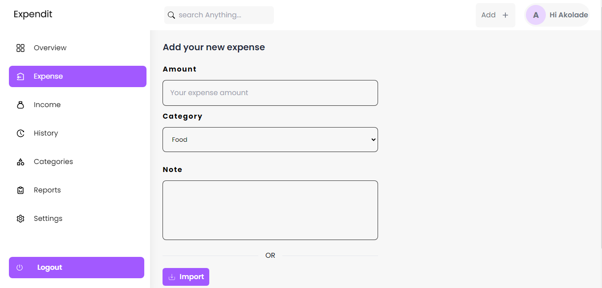
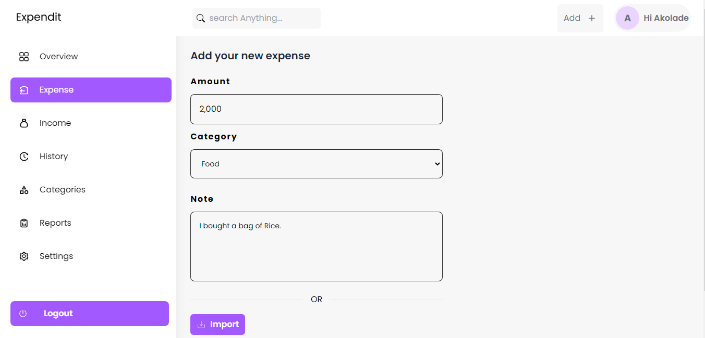
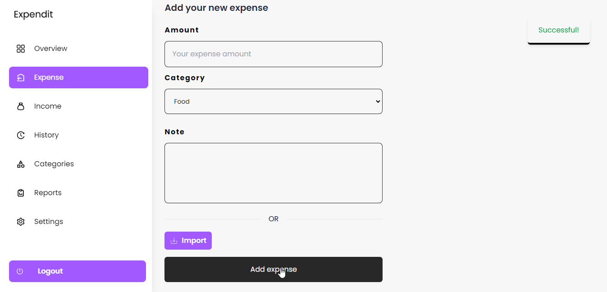
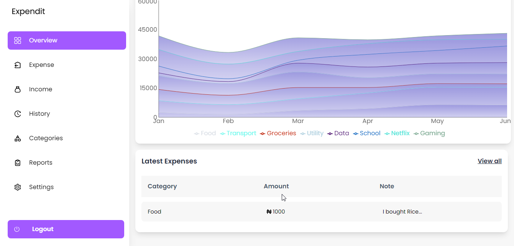

# Overview

Welcome to the Expense Page documentation for our Expense Tracker web app. This page serves as a guide for users on how to add expenses efficiently through the Expense Form.

## Form Structure

The Expense Form is designed to capture key details of your expense:

- **Amount:** Enter the amount spent.
- **Category:** Choose a category from predefined options (e.g., groceries, utilities, entertainment).
- **Description:** Provide a brief description of the expense.

## Adding a New Expense

To add a new expense, follow these steps:

1. **Navigate to the Expense Page:**

   - From the main dashboard or navigation menu, click on the "Expense" page to access the expense-related features.

2. **Expense Form:**

   - On the Expense Page, you will find an Expense Form that allows you to input details about your expense.

   

3. **Input Expense Details:**

   - Fill in the required details for the new expense:
     - **Amount:** Enter the amount spent.
     - **Category:** Choose a category from the provided options.
     - **Description:** Provide a brief description of the expense.

   

4. **Validation Processes:**

   - The Expense Form incorporates validation processes to ensure accurate and valid data entry. Common validations include:

     - **Amount Validation:** Ensures that the entered amount is a valid numerical value.
     - **Category Validation:** Verifies that a category is selected from the provided options.
     - **Description Validation:** May include checks for length or specific character types.

   - If there are validation errors, the form will provide clear feedback indicating the nature of the error(s). Users will be prompted to correct the entries before proceeding.

   

5. **Submit the Expense:**

   - Once all required fields are filled correctly, click the "Add Expense" button to submit the expense.

6. **Expense Request Payload:**

   - The request payload for adding an expense should be in JSON format and include the following fields:

     ```json
     {
       "amount": 50.0,
       "category": "Groceries",
       "description": "Weekly grocery shopping"
     }
     ```

7. **Processing and User Feedback:**

   - The system processes the expense addition request, simulating interactions with a database or data store.

   - During this process, users may see loading indicators or other feedback to indicate that the request is being processed.

   - If the addition is successful, the new expense details are displayed, and users receive a confirmation message.

   

8. **Expense Response Format:**

   - The response from the expense addition request will be in JSON format and include the newly created expense details:

     ```json
     {
       "id": 123,
       "amount": 50.0,
       "category": "Groceries",
       "description": "Weekly grocery shopping",
       "created_at": "2023-01-01T12:34:56Z",
       "updated_at": "2023-01-01T14:34:22Z"
     }
     ```

9. **Error Handling:**

   - In case of errors during the expense addition process, users will receive appropriate error messages with guidance on how to resolve the issue.

   

10. **Review the Updated Expense List:**

    - Users can review the updated list of expenses on the page, including the newly added expense.

    
